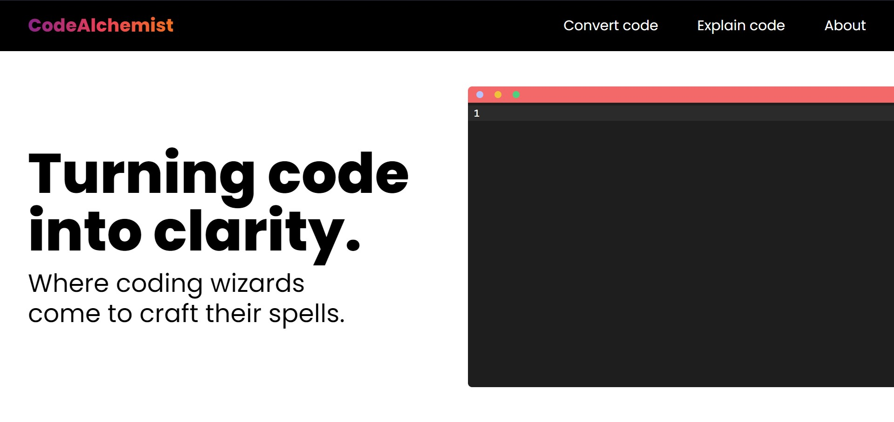

# Your code, no matter the language.

CodeAlchemist is an online platform designed to help developers convert code from one language to another, quickly and accurately. With real-time code analysis, it can explain any given piece of code. Powered by ReactJs, OpenAI api and Zustand for state management and React Router for routing, CodeAlchemist is the perfect tool for developers who need to quickly and accurately convert code from one language to another.

## [Check it out !](https://codealchemist.netlify.app/)
